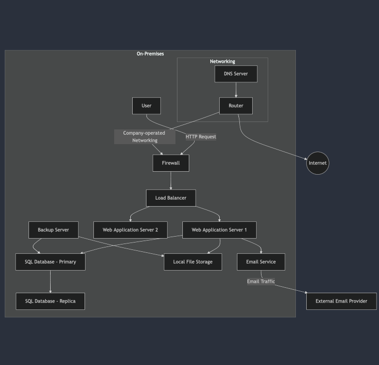
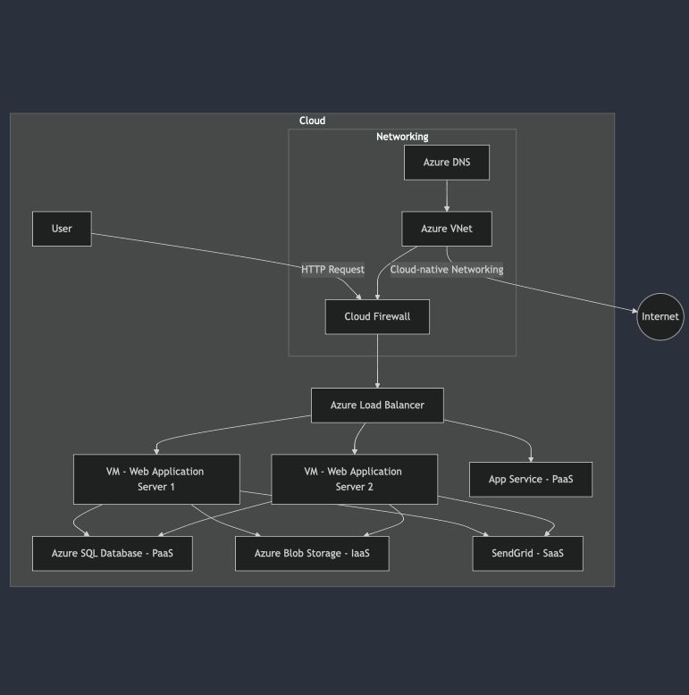

# Cloud Migration Lab

## Objective
Welcome to the Cloud Migration Lab! In this lab, we’ll explore how a mid-sized retail company can transition its infrastructure from traditional on-premises solutions to the cloud. We’ll dive into the different offerings—**PaaS**, **IaaS**, and **SaaS**—available from various cloud providers like Azure, focusing on understanding concepts and designing a solid architecture.

---

## 1. On-Premises Solution Design

### On-Premises Architecture Diagram

### Description
Let’s break down the current on-premises architecture:

- **Users**: Our users interact with the application via HTTP requests, which are securely managed through a firewall.
- **Load Balancer**: This essential component helps distribute incoming traffic across multiple web application servers, ensuring everything runs smoothly.
- **Web Application Servers**: These servers host the company’s monolithic web application. We have a primary SQL database and a replica for redundancy, making sure that our data is safe.
- **File Storage**: Currently, files are stored on a local system—this is where we keep things like images and documents.
- **Email Service**: We handle client notifications using an external email provider.
- **Networking**: The company's networking is managed through routers and DNS servers, facilitating connectivity with the outside world and maintaining a backup server for data recovery.

---

## 2. Migration Plan

Now, let’s talk about how we can migrate each component of our on-premises setup to the cloud. Below is a detailed plan outlining the migration strategies and reasoning for each component.

### Web Application

- **Migration Strategy**:
  - **Option 1 (IaaS)**: We can lift and shift the web application to **Azure Virtual Machines** (VMs).
  - **Option 2 (PaaS)**: Alternatively, we can refactor the application to run on **Azure App Service**.

- **Reasoning**: Choosing **PaaS** can significantly reduce the time and effort spent on server management, allowing our team to focus on application development instead.

- **Considerations**: We need to examine the application’s dependencies to ensure everything works seamlessly after migration.

---

### Database

- **Migration Strategy**: We will migrate our SQL Server database to **Azure SQL Database (PaaS)**.

- **Reasoning**: **PaaS** is a great fit here because it takes care of many database management tasks for us.

---

### File Storage

- **Migration Strategy**: Let’s move our file storage to **Azure Blob Storage (IaaS)**.

- **Reasoning**: Azure Blob Storage is perfect for handling large amounts of unstructured data.

---

### Networking

- **Migration Strategy**: We’ll replace our on-premises networking setup with **Azure Virtual Network (VNet)** and **Azure DNS**.

- **Reasoning**: **Azure VNet** provides a flexible and secure way to connect our cloud resources.

---

### Email Service

- **Migration Strategy**: Transition our email service to **SendGrid (SaaS)**.

- **Reasoning**: Offloading our email services to a **SaaS** solution allows us to benefit from high deliverability rates.

---

## 3. Cloud Architecture Design

### Cloud Migration Architecture Diagram

### Description
The proposed cloud architecture takes advantage of Azure’s services to create a modern, efficient environment:

- **VMs (IaaS)**: By hosting our web application on Azure VMs, we retain flexibility and control.
- **App Service (PaaS)**: We also have the option to run the application on **Azure App Service**.
- **Azure SQL Database (PaaS)**: Migrating our SQL database to **Azure SQL Database** allows us to utilize a managed solution.
- **Azure Blob Storage (IaaS)**: This transition ensures our file storage is scalable and secure.
- **SendGrid (SaaS)**: Moving our email service to SendGrid allows us to focus on our business logic without worrying about email infrastructure.

---

## 4. Benefits of Cloud Migration

Transitioning to the cloud offers numerous benefits:

- **Cost Savings**: Reducing the need for physical hardware can significantly cut operational costs.
- **Scalability**: The cloud allows us to easily scale resources based on demand.
- **High Availability**: Cloud providers often offer strong SLAs that ensure high uptime for our services.
- **Improved Performance**: With optimized resource allocation, we can expect enhanced performance.
- **Enhanced Security**: Cloud providers invest heavily in security measures, helping us protect sensitive data.

---

## 5. References

- Azure Documentation: [Microsoft Azure](https://docs.microsoft.com/en-us/azure/)
- Case Studies on Cloud Migration: [Cloud Adoption Framework](https://docs.microsoft.com/en-us/azure/cloud-adoption-framework/)

---

