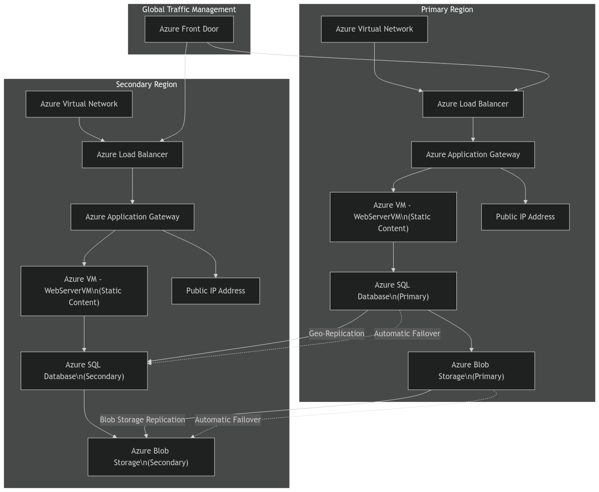

# High-Level Design Document for Multi-Region Deployment with Load Balancing

## 1. Introduction

This document outlines the high-level design (HLD) for migrating our application, which consists of two key virtual machines: **WebServerVM** (serving static content) and **SQLVM** (hosting the backend database). To enhance the application's reliability and ensure it can withstand outages, we’re deploying it across multiple regions with built-in load balancing. Our goal is to limit downtime to no more than 6 hours.

## 2. Solution Diagram

Here's a visual representation of our proposed architecture:

## 3. Target Architecture Description

### 3.1 Architecture Overview
This architecture consists of two main regions where the application will run. Each region hosts a virtual machine (VM) that acts as the web server (WebServerVM) and a SQL database (SQLVM). At the top, Azure Front Door serves as the global entry point, managing traffic and ensuring that user requests are efficiently routed to the right region. 

### 3.2 Redundancy and Failover Mechanisms
To ensure application is always available, I’ve incorporated several key features:
- **Global Load Balancer**: Azure Front Door intelligently routes incoming requests to the appropriate regional load balancers.
- **Load Balancers**: Each region has an Azure Load Balancer that distributes traffic to the application gateways, ensuring no single server gets overwhelmed.
- **Application Gateways**: These manage the web traffic to the VMs, providing additional security features like SSL termination and Web Application Firewall (WAF).
- **Database Geo-Replication**: The primary Azure SQL Database is replicated to the secondary region, allowing for automatic failover if the primary becomes unavailable.
- **Blob Storage Replication**: Our Azure Blob Storage accounts are set up to replicate data across regions, ensuring that static content remains accessible even during a failover.

## 4. Migration Steps

### 4.1 Replication of Virtual Machines Across Regions
1. **Set Up Networks**: Create Azure Virtual Networks (VNets) in both regions to facilitate communication.
2. **Deploy VMs**: Set up Azure VMs for the web servers, ensuring they are configured to host static content.
3. **Create SQL Databases**: Deploy Azure SQL Databases in both regions, enabling geo-replication to keep data in sync.

### 4.2 Configuration of Load Balancers
1. **Load Balancers Setup**: Configure Azure Load Balancers in each region to handle incoming traffic efficiently.
2. **Application Gateway Configuration**: Set up Azure Application Gateways to direct traffic to the web servers while managing SSL and providing security features.

### 4.3 Implementation of Database Replication and Failover
1. **Enable Geo-Replication**: Configure geo-replication for the Azure SQL Databases to ensure data consistency between regions.
2. **Set Up Failover Groups**: Implement failover groups to handle automatic database failover, ensuring seamless operation during outages.

## 5. Conclusion
This high-level design presents a robust plan for deploying the application in a multi-region architecture using Azure services. With features like load balancing, geo-replication, and automatic failover, aim is to create a reliable and highly available application. This setup not only enhances performance but also safeguards against potential downtimes, ensuring our users have a smooth experience.
