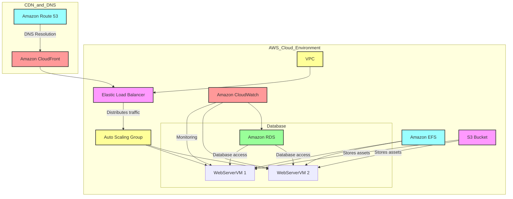

# High-Level Design (HLD) Document

## Refactoring Migration of Application

### Solution Diagram

### Description of the Target Architecture

The refactored architecture was designed to optimize the application's performance and ensure high availability using Amazon Web Services (AWS). At its core, the architecture featured a robust configuration that enhanced reliability and efficiency.

The architecture began with the establishment of a Virtual Private Cloud (VPC) to create a secure and isolated environment for all application resources. Within this VPC, an Elastic Load Balancer (ELB) was implemented to intelligently distribute incoming traffic between multiple WebServerVM instances. This distribution not only improved response times but also minimized the risk of overloading any single server.

To maintain optimal performance during fluctuating traffic demands, an Auto Scaling Group (ASG) was employed. The ASG automatically adjusted the number of WebServerVM instances based on real-time traffic patterns, ensuring that the application could efficiently handle both peak and low traffic periods without manual intervention.

Data management was streamlined with the integration of a managed relational database service, which provided a reliable and scalable solution for storing and retrieving application data. This service ensured efficient query performance and maintained the integrity of the data through automated backups and patch management.

Shared storage was facilitated through an Elastic File System (EFS), allowing the WebServerVM instances to access common data seamlessly. For static content, an S3 bucket was set up to store assets such as images, stylesheets, and backups, providing durability and availability.

To monitor the health and performance of the application, Amazon CloudWatch was configured to collect metrics and logs, enabling proactive management of any potential issues. Additionally, a content delivery network (CDN) was integrated to speed up the delivery of static assets, further enhancing the user experience. Finally, Amazon Route 53 was utilized for DNS management, ensuring users could reliably access the application.

Overall, this architecture significantly improved the application's resilience and performance, preparing it for future growth and demand.

### Steps of Migration

1. **Assessment and Planning**:
   - Begin by assessing the existing application architecture to identify components suitable for refactoring in the cloud. Develop a migration strategy that addresses architecture changes, data management, and expected downtime.

2. **Set Up AWS Environment**:
   - Create the VPC with appropriate subnets and security groups to house the application resources. Configure the Elastic Load Balancer to manage incoming traffic efficiently.

3. **Provision Resources**:
   - Launch the WebServerVM instances within an Auto Scaling Group to ensure redundancy. Set up Amazon RDS for the database and Amazon EFS for file storage.

4. **Application Deployment**:
   - Migrate the application code and any dependencies to the WebServerVM instances. Configure the database connections to ensure compatibility with the RDS instance.

5. **Testing**:
   - Conduct comprehensive testing to validate the application’s functionality and performance within the new AWS environment. Test the scaling behavior of the Auto Scaling Group and ensure monitoring through CloudWatch is operational.

6. **DNS Configuration**:
   - Set up Route 53 for DNS resolution, directing user traffic to the CloudFront distribution and Elastic Load Balancer.

7. **Go Live**:
   - Transition from the old environment to the new architecture. Monitor application performance closely after going live to identify any issues that arise.

8. **Post-Migration Optimization**:
   - Evaluate the application’s performance and optimize resources based on usage patterns. Continuous monitoring through CloudWatch will help identify areas for improvement and ensure the application remains performant.

### Summary

The refactoring migration project successfully transitioned an application with two virtual machines to a more robust architecture using Amazon Web Services (AWS). The new architecture was designed to enhance high availability and improve data management efficiency.

The migration process involved assessing the existing setup, designing the target architecture, and systematically configuring the necessary resources. This comprehensive approach ensured a scalable solution that met the application's performance and reliability requirements.

